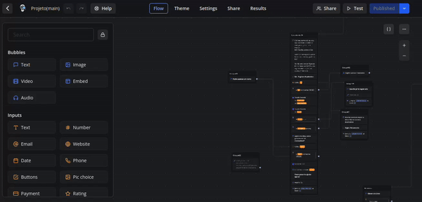

<h1 align="center">BIA - Bot Inteligente Acadêmico</h1>

## Sumário

* [Integrantes](#integrantes)
* [Descrição](#descrição)
* [Requisitos](#requisitos)
* [Tecnologias](#tecnologias)
* [Fluxo do Software](#fluxo-do-software)
* [Dificuldades](#dificuldades)
* [Resultados](#resultados)
* [Conclusão](#conclusao)

## Integrantes

- Anderson do Vale - [and3510](https://github.com/and3510) 
- Beatriz Barreto - [whosbea](https://github.com/whosbea)
- Cristovam Paulo - [cristovam10000](https://github.com/cristovam10000)
- Guilherme de Assis - [onizuka465](https://github.com/onizuka465)
- Gustavo do Vale - [gustavodovale](https://github.com/gustavodovale)
- Lucas Cesar - [lucascesar1107](https://github.com/lucascesar1107)

## Descrição

Chatbot universitário que ajuda os alunos a acessarem informações de forma rápida e precisa

## Requisitos
 
- Ser **aplicado no Whatsapp** - Não Funcional
- Ter uma função para **mandar Calendario Acadêmico** - Funcional
- Ter uma função para **mostrar horarios das provas** - Funcional
- Ter uma função para **mostrar as faltas do aluno** - Funcional
- Ter uma função para **o usuario reportar problemas da faculdade,chatbot ou curso** - Funcional
- Ter uma função para **pesquisar livros que estão na biblioteca** - Funcional
- Ter uma função para **mostrar as notas das provas e quizzes do aluno** - Funcional
- Ter uma função para **mostrar os números de telefone e emails da instituição** - Funcional
- Ter uma função para **começar um bate papo com uma IA, para tirar duvidas sobre as materias** - Funcional
- Usar Banco para **armazenar e buscar informações** - Não Funcional

## Tecnologias

- **Typebot**: Plataforma para criar chatbots interativos, sem programação complexa.
- **NocoDB**: Banco de dados visual que transforma dados em planilhas.
- **Evolution API**: Automação para envio de mensagens via WhatsApp.
- **WhatsApp**: Plataforma para troca de mensagens e comunicação instantânea.
- **ChatGPT**: IA para geração de conversas em linguagem natural.
- **Docker**: Virtualização de aplicações em contêineres para qualquer ambiente.
- **Postman**: Ferramenta para testar, monitorar e documentar APIs.

## Fluxo do Software

  

## Dificuldades

Realizar pesquisas acadêmicas com os alunos é desafiador devido à baixa participação, causada por falta de tempo ou desinteresse no tema. A sobrecarga de atividades acadêmicas e extracurriculares dificulta o comprometimento dos estudantes, afetando a qualidade e quantidade das respostas.

Tivemos problemas durante a execução dos testes do protótipo devido ao grande número de solicitações, o que causou algumas sobrecargas e paralisações nos testes.

Além disso, gastamos um tempo tentando enviar uma requisição HTTP da plataforma **Typebot** para a **API Evolution**.Felizmente, conseguimos ter sucesso após expor o serviço local à internet usando o comando `ngrok` no Linux.

Durante o projeto, fomos informados de que não poderíamos integrar o chatbot com o banco de dados da faculdade por questões de segurança. Isso reduziu as chances de o sistema ser adotado pela instituição, porém, poderíamos ajustar o projeto removendo as funcionalidades que dependiam de acesso ao banco de dados da faculdade, como **Ver Notas**, **Faltas** e **Biblioteca**.

## Resultados

### Fluxo do Typebot

**Fluxo de criação do bot na plataforma Typebot**

### Plataforma de Gerenciamento

**Plataforma para gerenciar as funcionalidades do bot, executado em contêiner**

### Tabelas do Banco de Dados

  

 

- A criação de personagens e dados fictícios foi realizada para testes com o chatbot e o banco de dados.
- Sete salas foram criadas, cada uma abrigando um personagem específico.
- O cursos criados foram 3 (Engenharia Software, Direito, Administração) com periodos diferentes e turnos.

### Menu Principal de Botões

    <table border="0" cellspacing="0" cellpadding="0" style="margin: auto;">
        <tr>
            <td style="border: 0; width: 800px; vertical-align: top; padding-top: 20px;">
                
            </td>
            <td style="vertical-align: top; padding-top: 20px;">
                A implementação de um menu interativo é essencial para melhorar a experiência do usuário em aplicativos e plataformas. Neste contexto, a API Evolution fornece uma maneira eficiente de criar menus dinâmicos e personalizáveis. Neste artigo, vamos explorar como desenvolver um menu com 8 botões utilizando a sendList da API Evolution.
            </td>
        </tr>
    </table>

### Feedback para o chatbot

**Aviso de feedback, após os usuarios encerrarem a conversa com o bot**

## Conclusão

